# Asthma Indoor Air Monitor

________________________________________

## Student Name: Sarah Barron 

_______________________________________
## About this project

As a student at Waterford Institute of Technology one of the modules I am studying is computer networking. The project which were required to complete was to create a project using networking/IoT standards and protocols, to incorporated physical devices such as sensors and to incorporate different layers (sensor, processing node, gateway, application) of an IoT/connected device architecture.

## Computer Networking Protocols and Standards used

### TCP/IP protocol Suite
 - Data Link Layer protocol
    - Wireless WiFi
         - Uses wireless 802.11 standard
         - Uses MAC - multiple access control protocol
    - ARP - Address Resolution Protocol
    - I2C protocol - Inter-Integrated Circuit
    - Physical Devices (Laptop, mobile phone, Raspberry Pi, BME680 sensor, wireless WIFI router)

 - Network Layer
    - Internet Protocol - host to host packet 
delivery
   
 - Transport Layer
    - TCP Transmission Control Protocol - best for HTTP.

 - Apllication Layer
    - HTTP - HyperText Transfer Protocol


## Project Proposal

I currently have 2 asthma and allergy sufferers living in my house and there are a number of triggers that effect their asthma including 

1. Humidity (moist / damp air) 
2. Temperature (mostly cold air but temperatures that are too high can also effect them)
3. Air quality - dust mites, smoke and chemicals such as hair spray, deodorants etc 

Therefore, the project I am proposing is a device to monitor indoor air quality, temperature and humidity within the home using a sensor.

When the sensor values go outside of the ideal values for an asthma sufferer. I will use the Blynk IoT application to send a notification to a my phone.

Every morning and night i will use the Blynk IoT application to send me a notification to remind me to give my 2 sons their asthma medication/inhaler.

Every morning I will send an email report with details of the average sensor values for the previous 24 hours. I will use ThingSpeak, MATLAB analysis, a time controller and IFTTT IoT application to accomplish this.

I will also send the sensor values to Blynk and ThingSpeak IoT applications every 15 seconds to allow me to store, retrieve and display sensor values on line graphs, number displays and gauges. The purpose of this is to allow me to check the current sensor values either on my phone or on my laptop at any time. It will also allow me to view the sensor data over longer periods of time to compare or have an overall view over time of air quality within the my home. This also allows me to complete MATLAB analysis on the sensor data.

There will be presence detection. I do not have access to my heating, humidifier or dehumidifier remotely. Therefore if I am in the house and the sensor values go out of range i will get a notification as I can do something about it when I am at home. However if there is nobody detected at home I will not receive out of range notifications as I can not do anything about it remotely. The settings for this can be changed by the user, if they want to receive notifications at all times when they are at home or when they are away from home they can set this up.

I also intend to create a website, that will show ThingSpeak graphs and current sensor readings and will describe the project.

## Project Details

### Settings for Asthma Sufferers
The general advice and from reading the [World Health Organization - Housing and Health Guidelines 2018](https://apps.who.int/iris/bitstream/handle/10665/276001/9789241550376-eng.pdf?ua=1), I set the default temperature range to between 18-21 Celsius. 
However the maximum level a user can set the temperature to is 24 Celsius as recommended by WHO. 
The ideal temperature is 21 C.

Again the general advice for humidity or moisture levels for asthma sufferers is between 30 - 50% with an ideal humidity level of 40%. The programs default settings is a range between 30 - 50%. A user has the choice to narrow this range but can not increase the range, as outside this range would be unhealthy for asthma sufferers.

The Index Air Quality measurement is calculated using 20% Humidity : 80% Gas levels. 
I have set the default IAQ range to between 0 and 100 as above this level can lead to members of sensitive groups to experience health effects.  
Between 50-100 Air quality is acceptable; however, for some pollutants there may be a moderate health concern for a very small number of people who are unusually sensitive to air pollution. 
If the Asthma sufferer is unusually sensitive they have the option to reduce the default IAQ level down to a level they are happy with.

Initially the user will either use the sensor with the default values:

Temperature: 18-21 Celsius

Humidity: 30-50 %RH

Index Air Quality : 0-100 IAQ

or set their own values which must be set within healthy ranges for Asthma sufferers. This can be set up via a shell scripting menu before the sensor is run.

#### BME680 Sensor -> IoT's
The BME680 sensor which is attached to the Raspberry Pi 3B senses the temperature, humidity and gas levels every 15 seconds and sends the values to Blynk an IoT mobile application that controls hardware remotely and to Thingspeak an IoT application that stores and displays sensor values and reacts using MATLAB Analysis, TimeControl and IFTTT another IoT application to manage services, to send an email to the user daily with the average temperature, humidity and IAQ levels for the previous 24 hours. 

#### Blynk
When the Temperature, Humidity or Air Quality goes out of range the user will be sent a Blynk notification to inform them of this out of range value.

Blynk displays the 3 sensor values in numeric gauge form and with a color system.

For temperature and humidity values in range will show as green, just out of range will show as orange and a further out of range level will show as red. 

The IAQ levels will show as their standard colors starting at a good level represented by green and as the IAQ gets worse the colors change from yellow to orange to red to purple and finally to burgundy.


##### Presence Detection
There is a presence detection setup using arp-scan, this detects if someone is in the house. If no-one is home the notifications will not be sent as the user can not control devices such as temperature, humidifier, dehumidifier etc remotely. However, if the user has remote access to devices they can set this up in the setup or main menu. The user will then receive notifications at all times as they have remote access to devices.

Using Blynk and an eventor, a notification is sent each morning and night to remind the user to take or give the inhaler medication to the Asthma Sufferer.

The User can use Blynks mobile App to view the current readings at any time and a line graph showing past readings for up to 3 months.

#### ThingSpeak
Data is also stored, retrieved and displayed on a ThingSpeak Channel, for the user to view or analyse.
Every morning Thingspeak has a time control setup to do MATLAB Analysis. 
The MATLAB analysis retrieves the previous 24 hours sensor readings. The average temperature, humidity and IAQ levels are calculated. These values are send using HTTP to IFTTT.

#### IFTTT
When IFTTT receives the trigger email each morning with the average values it enters these values into an template email and sends the email to the user.


#### Website 
If someone other than the person registered with ThingSpeak wants to view the current temperature, humidity or Index Air Quality they can do so on the [website](http://networking-iot-project.surge.sh/)

________________________________________
## Tools, Technologies and descriptions

1. Wireless Wifi router - used to route data between devices.
2. Android Smartphone - for setting up the Blynk application and for receiving notifications.
3. Laptop with MicroSD Card Reader
4. [Raspberry Pi 3b](https://ie.farnell.com/element14/pi3-ibm-iot-learnkit/raspberry-pi-3-ibm-iot-learner/dp/2606882?ost=PI3+IBM+IOT+LEARNKIT&ICID=redirect-Y&CMP=os-geobanner-google) – small, low cost computer which connects to a sensor. 
5. [BME680](https://www.mikroe.com/environment-click) – environmental sensor which measures high-accuracy gas, humidity, temperature and pressure. 
6. Jumper Wires
7. [I2C bus](https://i2c.info/)  serial communication protocol.
8. HTTP - Hyper Text Transfer Protocol used for communication/messaging between devices.
9. [Rasbian buster lite](https://www.raspberrypi.org/downloads/raspbian/) – raspberry Pi’s operating system for headless use.
10. MicoSD Card 
11. [7-Zip](https://www.7-zip.org/download.html) (windows) - to extract the raspbian image
12. [Etcher](https://www.balena.io/etcher/) - to flash raspbian to the MicroSD Card.
13. [Notepad++](https://notepad-plus-plus.org/downloads/) - for creating the wpa_supplicant.conf file
14. [Putty](https://putty.org/) - SSH secure shell to connect to the Raspberry Pi. 
15. [Blynk](https://blynk.io/) - Internet Of Things mobile application to connect to hardware remotely and send notifcations
16. [ThingSpeak](https://thingspeak.com/) - Internet Of Things application to store, retrieve, display, analyse and react to data.
17. MATLAB - a programming platform for numerical analysis.
18. [IFTTT](https://ifttt.com/) - Internet Of Things application to manage services such as email.
19. Git – for version control 
20. [GitHub](https://github.com/) – web based git version control repository hosting service
21. [Harp](http://harpjs.com/) - local web server used prior to deployment of website 
22. [Surge](https://surge.sh/) - To deploy the website
23. [NodeJs](https://nodejs.org/en/) - JavaScript Runtime
24. HTML - Hypertext language markup language
25. CSS - Cascading Style Sheets
26. [Python](https://www.python.org/downloads/release/python-2717/) programming language – a general purpose programming language that is widely used with the Raspberry PI. 
27. Shell Scripting language - command line interpreter for the menu system
28. JSON - JavaScript Object Notation - for storing and retrieving user's ideal or default range settings.  
29. Libraries and packages I needed to install
   - bme680-python
   - smbus
   - ic2detect
   - harp
   - surge
   - node version 6
   - npm
   - blynk-library

## How I setup the project
### Raspberry Pi 3B

- Download [7-Zip](https://www.7-zip.org/download.html) (windows)
- Download [Etcher](https://www.balena.io/etcher/)
- Download [Rasbian buster lite](https://www.raspberrypi.org/downloads/raspbian/)
- Download [Putty](https://putty.org/)
- Download [Notepad++](https://notepad-plus-plus.org/downloads/) 
- Using 7-zip unzip the Raspbian buster lite image
- Put the MicroSD card into the computers card reader
- Open Etcher and select the Rasbian buster lite image file that was just downloaded.
- Select the SD card you want to write the image to.
- Click the Flash button and wait for the write to finish.
- Open the MicroSD drive from the computer. 
- Inside the boot partition create an empty file called ssh
- Inside the boot partition create a file called wpa_supplicant.conf using Notepad++ and enter the following into this file (replace the SSID and PSK with your own WIFI SSID and PSK):
``` 
country=IE
ctrl_interface=DIR=/var/run/wpa_supplicant GROUP=netdev
update_config=1

network={
scan_ssid=1
ssid="YOUR SSID"
psk="YOUR PSK"
key_mgmt=WPA-PSK
}
```
- Eject the MicroSD card from the computer and put it into the MicroSD slot on the Raspberry Pi.
- Turn on the power
- Open command prompt and check if the Raspberry Pi connected to the network using the command `nmap -sn 192.168.8.0/24` from this get the IP address of your Raspberry Pi
- Open the secure shell Putty
- Under the Host Name (or IP address) enter the Raspberry Pi's IP address and use Port 22
- Enter the the user id `pi` and password `raspberry` you can change these in the raspi-config utility
- This confirms you are able to login and connect to the Raspberry Pi. Now Disconnect from Putty and Power off the Raspberry Pi in order to connect the BME680 sensor.
### Connect the BME680 sensor to the Raspberry Pi B3
- Using the Jumper wires connect the BME680 sensor to the Raspberry Pi connecting pins 
   - 3.3V (RPi) -> 3.3V (BME680)
   - gnd (RPi) -> gnd (BME680)
   - SDA1 (RPi) -> SDA (BME680)
   - SCL1 (RPi) -> SCL (BME680)


- Turn the power to your Raspberry Pi back on 
- Once the bootup is finished as we did previously connect to The Raspberry Pi via SSH Putty.
- Clone and install the BME680 python library using the following commands 
```
$git clone https://github.com/pimoroni/bme680-python.git

$cd bme680-python/library

$sudo python setup.py install

$cd ~
```
- At this stage I ran into a problem `ImportError: No module named smbus`

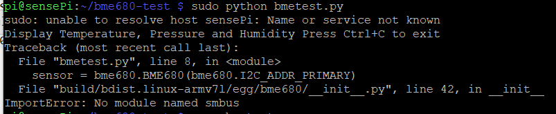
- To overcome this problem I installed smbus
```
$ sudo pip install smbus
```
- Enable the 12C Interface
``` 
$ sudo raspi-config
```
- Select option 5 Interfacing Options

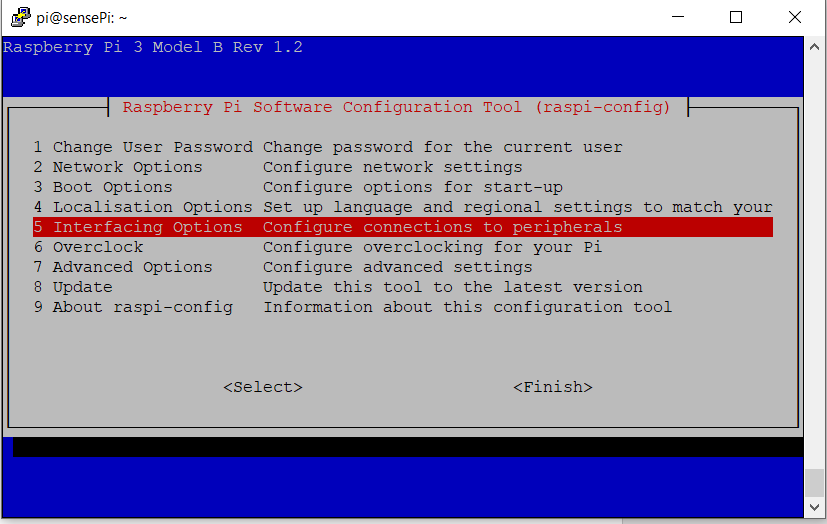
- Select P5 I2C


- Select Yes

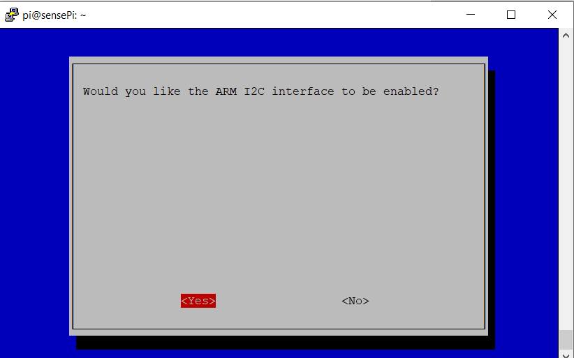
- Finish
- Enter the following command to reboot the Raspberry Pi
```
$ sudo reboot
```
- Scan the I2C bus for your device. Install i2cdetect and run the command to detect devices on the I2C bus
```
$ sudo i2cdetect -y 1
$ sudo /usr/sbin/i2cdetect -y 1
```
- You should see a number where your device is see below my device was on 7 X 77

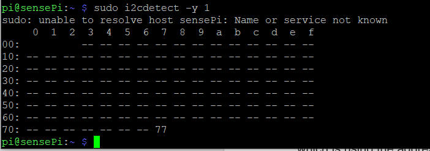

### IFTTT 
- Register an account with [IFTTT](https://ifttt.com/discover)
- In the navigation menu click on the profile symbol and select Create


- Click on This


- In the Search bar type in webhooks

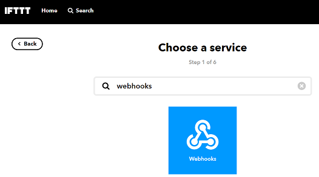
- Click on Receive a web request
- Enter an Event Name

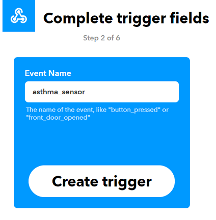
- Click on +That


- In the search box enter email and select Email

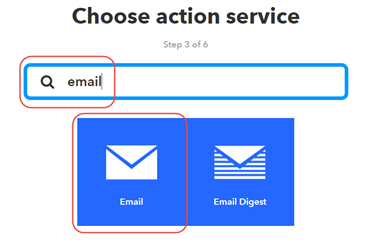
- Click on Send me an email


- Fill in the emails action fields (subject and body) as in the image below and click the create action button


- Review and finish.
- Copy the Make a POST or GET web request to URL

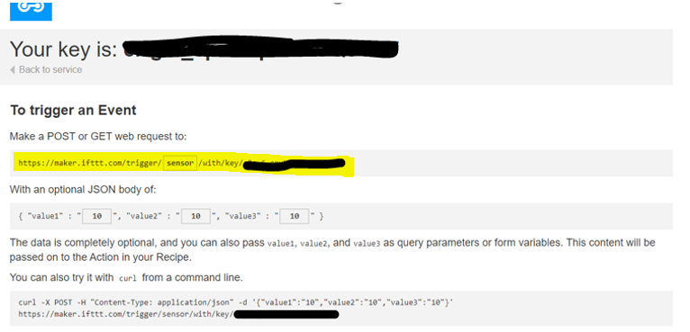


### ThingSpeak
- Register an account with [ThingSpeak](https://thingspeak.com/)
- Create a new channel called air-quality

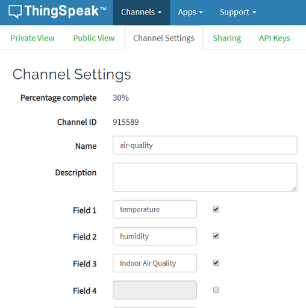

- like in the diagram above create 3 fields  
        - Field 1 - temperature
        - Field 2 - humidity
        - Field 3 - Indoor Air Quality
- Save the channel
- For each Field add a gauge
       - Add widget
       - Click on the Gauge Image
       - And set up the settings as in the below diagrams for each field.

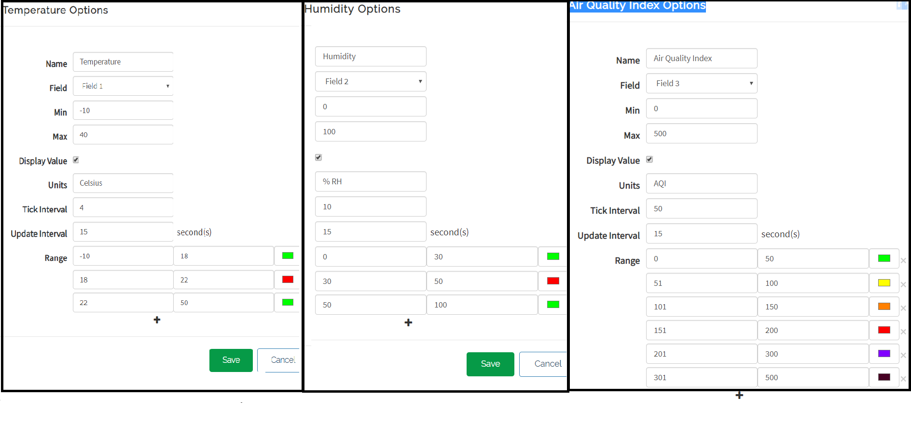 
- On the main menu click on Apps and then MATLAB Analysis
- Click the New button to create a new MATLAB Analysis
- Enter Trigger Email from IFTTT as the Name
- In the MATLAB Code section add the following code:
```
% Read the values in from Indoor Air Quality for the last 24 hours
% Send an email via the IFTTT service with the daily averages
%

% Store the channel ID for the Indoor Air Quality channel.
% Substitute with your own channelID
channelID = **** ;

% trigger url from IFTTT. 
iftttURL = '** PASTE THE IFTTT URL YOU COPIED EARLIER IN HERE **';

% Read API Key:
% Substitute your ThingSpeak API Key here
readAPIKey = '*******';

% Read the 24 hours of moisture data from ThingSpeak.
temperature = thingSpeakRead(channelID,'NumDays',1,'Fields',1,'ReadKey',readAPIKey);
humidity = thingSpeakRead(channelID,'NumDays',1,'Fields',2,'ReadKey',readAPIKey);
iaq = thingSpeakRead(channelID,'NumDays',1,'Fields',3,'ReadKey',readAPIKey);


% Calculate average values of temperature, humidity and indoor air quality
avgTemp = mean(temperature, 'omitnan');
avgTemp = round(avgTemp,2);
avgHum = mean(humidity, 'omitnan');
avgHum = round(avgHum,2);
avgIaq = mean(iaq, 'omitnan');
avgIaq = round(avgIaq,2);

% send the email
webwrite(iftttURL,'value1',avgTemp,'value2',avgHum,'value3',avgIaq);
```

- Create a time control go to Apps on the navigation bar and choose time control
- Enter the settings as seen in the diagram below

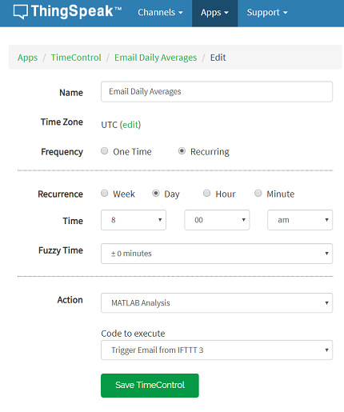 

- Click Save TimeControl

### Blynk
- Using your Smartphone download the [Blynk App](https://blynk.io/en/getting-started)
- Create a new account
- Create a new project
   - Name: Air Quality
   - Choose Raspberry Pi 3

- Set up 3 gauges:
   - Click on the + symbol

     
    - From the menu select Gauge

      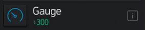
   - Click on the Gauge that has been created on the dashboard and set up each gauge like the diagram below
       - One Gauge for Temperature (V1)
       - One for Humidity (V2)
       - One for Index Air Quality (V3)

   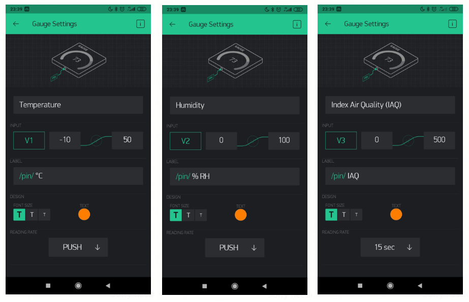
- Set up 1 Super chart
   - Click on the + symbol

   
   - Select SuperChart from the menu 
   
   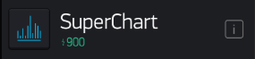
   - Setup the SuperChart the same as the settings in the diagram below
   
   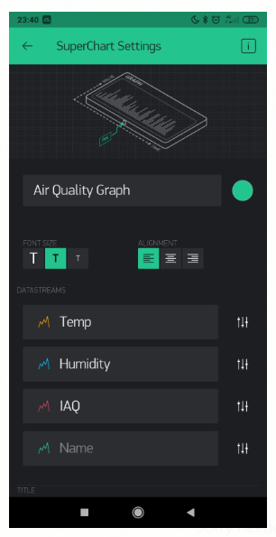
   - For each of the Datastreams (Temp, Humidity, IAQ) click on the small side menu option
   
    
   - For each one set them up like the diagram below
   
   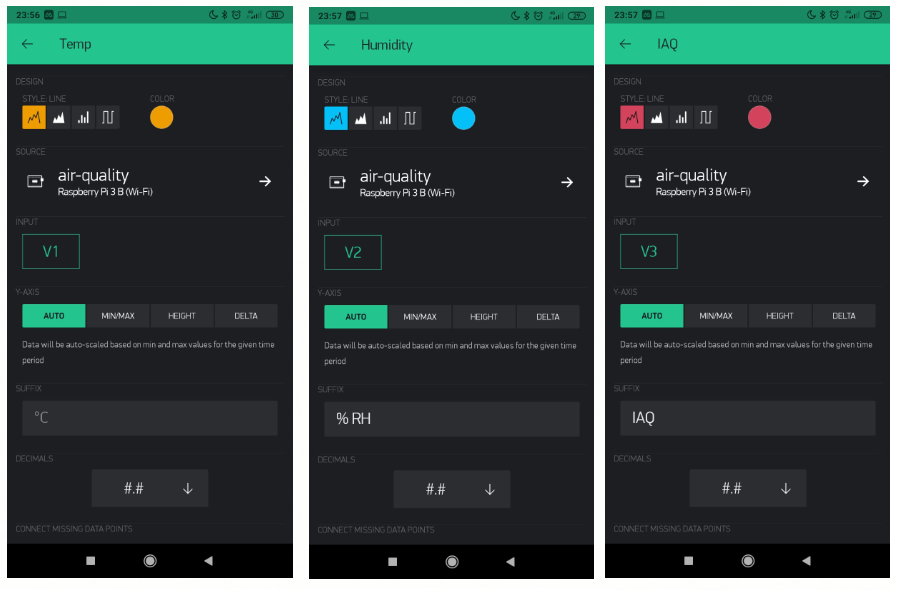
- To setup eventors to send Blynk notification reminders to take asthma medication/Inhaler
   - click on the plus symbol again
   
   
   - Select Eventor from the menu
   
   
   - Click the add new event button
   - setup 2 events with the details the same as the diagram below
   
   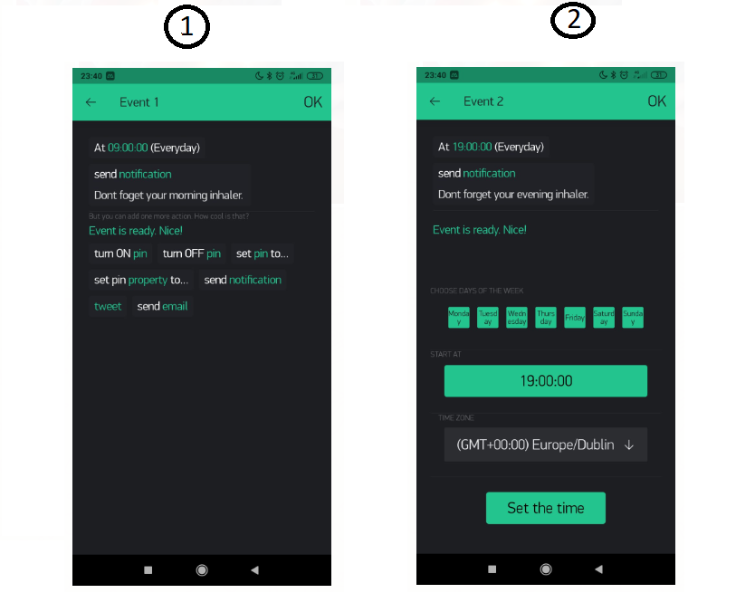

#### Setup Blynk on Raspberry Pi 3
- Connect to the Raspberry Pi vi SSH and login
- Check if you have node installed on the Raspberry by 
``` 
$ node -V
```
if it is installed it will return a version number. If the version number is not version 6 then you will have to uninstall it an reinstall version 6 as follows.

Uninstall node
```
$ sudo apt-get purge node nodejs node.js -y
$ sudo apt-get autoremove
```

Install node version 6
```
sudo su

cd /opt

wget https://nodejs.org/dist/v6.9.5/node-v6.9.5-linux-armv6l.tar.gz -O - | tar -xz
mv node-v6.9.5-linux-armv6l nodejs

apt-get update && apt-get upgrade
apt-get install build-essential

ln -s /opt/nodejs/bin/node /usr/bin/node
ln -s /opt/nodejs/bin/node /usr/bin/nodejs
ln -s /opt/nodejs/bin/npm /usr/bin/npm

exit

export PATH=$PATH:/opt/nodejs/bin/
```
- Install the blynk-library
```
sudo npm install blynk-library --save
```
### Setup environmental variables

- Retrieve your Blynk Auth Token from the email they sent you.
- Retrieve your ThingSpeak Write API Key from your ThingSpeak Channel


- Connect to the Raspberry Pi via SSH and login
- Enter the following commands and substitute your Thingspeak API key and Blynk Authentication key in for the ***
```
$ cd ~/
$ nano .bash_profile

export THINGSPEAK_WRITE_API=***
export BLYNK_AUTH=***
``` 
   CTRL+X and y to save


### Clone project
- Make a new directory and clone the project
```
$git clone https://github.com/sarahbarron/Asthma-Trigger-Monitor.git
```
### Run program
- To run the start menu
```
$ cd Asthma-Trigger-Monitor
$ ./startmenu.sh
```
- In the Blynk app make sure to press the play button to run the App.
- This will start your menu there is 9 options
1. START SENSOR - this starts the sensor transmitting temperature, humidity and IAQ data to IoT platforms Blynk and Thingspeak.
2. View sensor settings - allows you view the current range settings.
3. Setup main settings - Allows you change the default settings for the ranges you want to receive notifications for
4. Setup Temperature Range - Allows you change the default settings for the temperature range.
5. Setup Humidity Range - Allows you change the default settings for the Humidity range.
6. Setup IAQ Range - Allows you change the default settings for the IAQ range.
7. Setup Remote Access - Allows you enter y or n to indicate if you do or do not have remote access to devices.
8. Reset settings to default settings - Resets the ranges back to the default ranges of temperature (18-21 degrees Celsius), humidity (30-50% RH), Index Air Quality(0-100 IAQ).
9. Quit - allows you quit the program

- To use the default settings and run the program enter 1 into menu prompt 


## Things I tried but didn't work!
### WIA
I initially setup my data to be sent to WIA and was going to trigger my email from there, but there were a number of issues. Initially I had the graphs set up and when i tried to embed the graphs into my website they did not show. I contacted the customer help chat and was told this was not a feature they had setup even though they had the embed code attached to the widget. In fairness to them they set it up straight away and within an hour or two i was able to view the graphs. However the embedded digit values updated on the website instantly but the line graphs did not update with live data, you needed to refresh the web page every time to see the current line graphs that corresponded with the digit display. I sent messages to WIA a few times about this but got no reply and their chat bot seems to be disabled now. I decided to change at this stage to ThingSpeak and was able to embed all graphs into my website, you don't have to refresh your page to see current data, it updates automatically and I was able to setup e-mail with IFTTT fairly easily. 

### Presence detection - bluez bluetooth & nmap
I find that arp-scan sometimes does not detect you when you are at home so i decided to try [bluez](http://www.bluez.org/about/) a linux bluetooth protocol stack, to scan for bluetooth devices, This worked at the beginning and seemed more accurate but it took longer and after a while everytime i ran a bluez scan it would cause the connection from my SSH to the Raspberry Pi to crash. I then tried nmap and again this was more accurate but constant running of this command also caused the connection between my SSH and Raspberry Pi to crash, so I reverted to arp-scan.

## References
 - [World Health Organization - Housing and Health Guidelines 2018](https://apps.who.int/iris/bitstream/handle/10665/276001/9789241550376-eng.pdf?ua=1) 
- [Blynk Documentation](http://docs.blynk.cc/)
- [ThingSpeak Documentation](https://uk.mathworks.com/help/thingspeak/)
- [uk.mathworks.com](https://uk.mathworks.com/help/thingspeak/analyze-channel-data-to-send-email-notification-from-ifttt.html) - Connecting ThingSpeak to IFTTT to send an email
- [BME680](https://www.mikroe.com/environment-click) had built in example programs. One program was to calculate Indoor Air Quality. This helped me calculate this value and I was able to do my own conversion then to calculate the Index Air Quality figure.